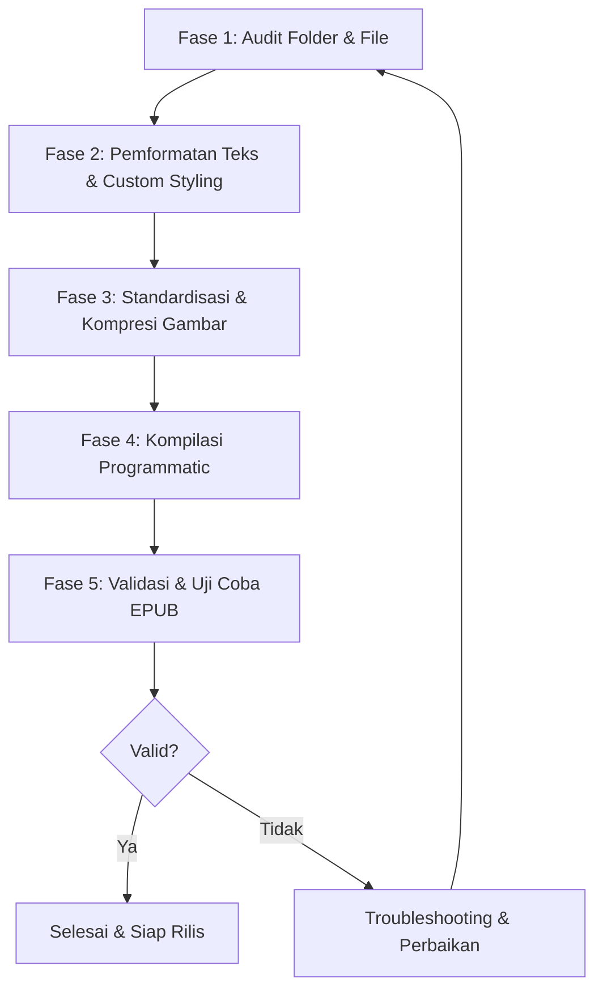

# Panduan Utama & Alur Kerja Otomatisasi Pembuatan EPUB Novel (AI-Ready Guide)

Panduan ini dirancang sebagai instruksi detail langkah-demi-langkah (workflow) bagi AI Agent maupun Compiler manusia untuk memproses, memvalidasi, mengompresi, mendownload gambar, dan mengompilasi novel dari format Markdown/Teks menjadi file EPUB premium dengan layout modern.

---

## 📌 DAFTAR ALUR KERJA UTAMA (MASTER CHECKLIST)

Secara umum, proses pembuatan EPUB terbagi menjadi 5 fase berikut yang harus diikuti secara berurutan:



---

## 📂 FASE 1: AUDIT FOLDER & VERIFIKASI FILE (SANITY CHECK)

Sebelum menjalankan script kompilasi, AI/Compiler harus memastikan seluruh folder dan file dalam keadaan lengkap serta terstruktur dengan benar.

### 1. Verifikasi File Utama `main.md`
Setiap folder volume novel **wajib** memiliki file `main.md` di root folder tersebut. Periksa dan pastikan hal-hal berikut:
*   [ ] **Metadata Lengkap**: Pastikan metadata berikut terisi dengan benar di dalam tanda kurung siku `[...]`:
    ```markdown
    Title Japan: [Judul Asli Jepang]
    Title Indonesia: [Judul Indonesia]
    Title Inggris : [Judul Inggris]
    Author: [Nama Penulis]
    Artist: [Nama Illustrator]
    Genres: [Genre 1, Genre 2, dll]
    Translator: [Penerjemah]
    EPUB Compiler : [Penyusun EPUB]
    ```
*   [ ] **Cover Deklarasi**: Baris `Cover : [path_gambar]` harus menunjuk ke file cover yang valid (misal: `images/01.png` atau `images/1.jpg`).
*   [ ] **Struktur Table of Content**: Blok `Table of Content[` hingga tutup kurung siku `]` di akhir baris harus berisi daftar bab secara urut.

### 2. Verifikasi Keberadaan File Fisik Bab (MD)
*   [ ] Bandingkan file `.md` yang dideklarasikan di dalam daftar `Table of Content` dengan file fisik yang ada di dalam folder.
*   [ ] Format deklarasi bab harus berakhiran `(file)`, contoh: `[Chapter 1.md(file)]`.
*   [ ] **Deteksi Missing File**: Jika ada bab yang terdaftar di `main.md` tetapi file fisiknya tidak ada di folder (atau ada kesalahan penulisan nama file, huruf besar/kecil), laporkan dan perbaiki sebelum melakukan kompilasi!

### 3. Verifikasi Keberadaan Folder & File Ilustrasi
*   [ ] Periksa apakah folder gambar ada (bisa bernama `images/`, `Ilustrasi/`, atau `Ilustarasi/`).
*   [ ] **Deklarasi Ilustrasi Bab**:
    *   Jika menggunakan metode bab ilustrasi khusus (misal: `[Ilustrasi.md(file)]`), pastikan file `Ilustrasi.md` tersebut ada dan berisi daftar tag gambar: `(image) [images/k001.jpg]`.
    *   Jika menggunakan metode daftar langsung (misal: `[Ilustrasi(images/02.png,03.png,04.png)]`), pastikan setiap file gambar tersebut ada di dalam folder gambar.

---

## ✍️ FASE 2: PEMFORMATAN TEKS & CUSTOM STYLING ALIGNMENT

Novel premium kita menggunakan pemformatan khusus untuk elemen-elemen cerita agar terasa hidup dan responsif. AI/Compiler harus memeriksa konten file `.md` untuk mendeteksi penulisan gaya khusus berikut:

### 1. Deteksi Simbol & Tag Khusus
Gunakan cheatsheet pemformatan berikut untuk menata isi cerita di setiap file bab `.md`:

| Gaya Teks | Cara Penulisan di Markdown | Hasil Tampilan di EPUB |
| :--- | :--- | :--- |
| **Scene Break** | Baris kosong baru + `***` atau `---` | Simbol elegan `❖ ❖ ❖` di tengah halaman secara vertikal. |
| **Kotak Pikiran** *(Thought Box)* | Tulis `(thought) Gumaman batin` di baris tersendiri. | Kotak abu-abu transparan elegan dengan border kiri. |
| **Pikiran Inline** *(Inline Thought)* | Sisipkan `(thought) [gumaman]` di tengah kalimat biasa. | Teks miring (`italic`) berwarna abu-abu gelap. |
| **Kotak Status UI** *(Stats Box)* | Dibungkus tag `[stats]` ... `[/stats]` | Kotak UI premium berlatar terang dengan border hitam tebal kiri dan font sans-serif. |
| **System Notification** *(Game UI)* | Dibungkus tag `[UI]` ... `[/UI]` | Kotak game retro gelap dengan border neon biru bercahaya, font pixel retro **VT323**, dan teks tebal putih bercahaya. |

### 2. Penanganan Otomatis Gambar Online (Image Downloader & Sanitizer)
Jika di dalam teks Markdown terdapat link gambar eksternal (misal dari WordPress: ``):
*   [ ] **Hapus Query Parameter**: Script `build_novel.py` akan otomatis menghapus query parameter pembatas ukuran (seperti `?w=730` atau `?w=...`) agar gambar di-download dalam resolusi penuh/aslinya.
*   [ ] **Auto-Download & Save**: Gambar akan otomatis di-download dengan nama file yang disanitasi (karakter khusus dan spasi diubah menjadi underscore `_`) dan disimpan di folder `images/` lokal.
*   [ ] **Auto-Replace Reference**: Referensi gambar online di file Markdown bab akan digantikan secara otomatis menjadi tag lokal: `(image) [images/nama_file.webp]`.

---

## 🖼️ FASE 3: STANDARDISASI & KOMPRESI GAMBAR

Gambar yang terlalu besar akan membuat file EPUB menjadi sangat lambat saat dibuka dan menghabiskan memori e-reader. Script kita memiliki prosesor gambar otomatis menggunakan modul `PIL` (Pillow).

### 1. Kompresi & Konversi Otomatis ke WebP (Auto-Process)
Saat script dijalankan, modul `auto_compress_folder` akan memindai folder gambar secara otomatis:
*   [ ] **Downscaling**: Gambar dengan resolusi melebihi **2000px** pada lebar atau tingginya akan diperkecil (downscaled) dengan mempertahankan rasio aspek menggunakan filter kualitas tinggi `LANCZOS`.
*   [ ] **Konversi Format**: Gambar berformat `.png`, `.jpg`, atau `.jpeg` akan dikonversi menjadi format `.webp` untuk kompresi optimal.
*   [ ] **Sinkronisasi Referensi Bab**: Setelah konversi format terjadi (misal `01.png` menjadi `01.webp`), script akan otomatis memindai seluruh file `.md` bab dan memperbarui semua string referensi lama ke ekstensi `.webp` yang baru agar tidak terjadi broken image!
*   [ ] **Kompensasi Ukuran**: Gambar WebP/JPEG berukuran besar (melebihi batas default **1.5 MB** di `settings.ini`) akan dikompresi bertahap (kualitas 90 → 85 → 75 → 65 → dst) hingga berada di bawah batas ukuran aman.

---

## ⚙️ FASE 4: KOMPILASI PROGRAMMATIC (RUNNING THE BUILDER)

Setelah seluruh file bab dan gambar diaudit serta diproses, saatnya melakukan kompilasi menjadi file EPUB.

### 1. Perintah Eksekusi Script
Buka terminal/PowerShell di direktori kerja, lalu jalankan script `build_novel.py` dengan argumen path folder novel target:
```powershell
python build_novel.py "d:\code iwan\EPUB\Nama Folder Novel Volume X"
```

### 2. Solusi Ilustrasi Gabungan (Grouped Illustrations) — *SANGAT PENTING!*
> [!IMPORTANT]
> **Mengapa Gambar Ilustrasi Sering Hilang/Hanya Terbaca Sebagian?**
> Pada e-reader modern (seperti Lithium, Google Play Books, dll), halaman XHTML di dalam struktur EPUB (`spine`) yang ditandai dengan `exclude_from_toc: True` pada file `build_novel.py` versi lama akan **diabaikan atau dilewati** secara otomatis. Jika ilustrasi dipisah menjadi beberapa file XHTML terpisah, pembaca hanya akan melihat ilustrasi pertama dan ilustrasi berikutnya akan "hilang".
>
> **Solusi yang Diterapkan Script Kita:**
> Seluruh gambar ilustrasi dalam halaman/bab ilustrasi akan digabungkan ke dalam **satu file XHTML tunggal** (`illustrations.xhtml` atau `chapter-XX-01.xhtml` untuk bab gambar saja). Di dalam XHTML tunggal ini, setiap gambar dibungkus oleh `.full-page-image` dengan gaya CSS `page-break-before: always` dan `page-break-after: always`.
>
> Hasilnya:
> 1. E-reader akan mendeteksi seluruh ilustrasi karena berada dalam satu file yang terdaftar di TOC.
> 2. Pembaca e-book tetap melihat gambar satu per satu secara penuh di layar (efek full-screen page break) tanpa tergabung dalam satu scroll panjang.

### 3. Struktur & Urutan Navigasi TOC yang Wajib Diikuti
Navigasi EPUB (`nav.xhtml`) yang dihasilkan script harus secara ketat mengikuti urutan layout premium berikut:
1.  **Cover** (Mengarah ke halaman cover depan `cover.xhtml`)
2.  **Ilustrasi** (Mengarah ke file ilustrasi gabungan `illustrations.xhtml` atau `chapter-XX-01.xhtml`)
3.  **Table of Contents** (Navigasi utama yang menunjuk ke dirinya sendiri `nav.xhtml`)
4.  **About** (Informasi detail metadata buku `about.xhtml`)
5.  **Chapters/Story Pages** (Bab-bab cerita secara berurutan: Prolog, Bab 1, dst.)

---

## 🧪 FASE 5: VALIDASI & VERIFIKASI HASIL AKHIR (EPUB TESTING)

Jangan pernah merilis file EPUB sebelum melakukan pengujian kualitas secara menyeluruh. Lakukan langkah-langkah validasi berikut:

### 1. Verifikasi Fisik File EPUB
*   [ ] **Lokasi Output**: Pastikan file `.epub` baru telah dibuat di folder yang ditentukan (biasanya folder induk/parent dari folder novel).
*   [ ] **Cek Ukuran**: Pastikan ukuran file EPUB masuk akal (misal: jika berisi teks + 5-10 gambar WebP terkompresi, ukurannya berkisar antara **3 MB - 12 MB**). Jika ukuran file di atas 30 MB, periksa apakah ada gambar mentah yang belum terkompresi.

### 2. Validasi Struktur Internal (Metode Unzip Manual)
Jika diperlukan audit mendalam, ganti ekstensi `.epub` menjadi `.zip` lalu ekstrak isinya. Pastikan:
*   [ ] File `mimetype` berada di **paling atas/pertama** dalam paket ZIP dan disimpan dengan mode **Tanpa Kompresi (ZIP_STORED)**. Hal ini mutlak agar EPUB dideteksi valid oleh e-reader.
*   [ ] Folder `META-INF/` berisi `container.xml`.
*   [ ] Folder `OEBPS/` berisi folder `xhtml/`, `images/`, `css/` (menyimpan `style.css`), dan file `content.opf`.
*   [ ] Seluruh aset gambar di `OEBPS/images/` bertipe `.webp` dan tidak ada referensi broken link di dalam XHTML.

### 3. Pengujian Tampilan di E-Reader Aplikasi
Kirim file EPUB hasil build ke perangkat mobile atau buka menggunakan Emulator/E-reader app (Sangat direkomendasikan memakai **Lithium**, **Calibre**, atau **Sigil**):

*   [ ] **Test Ilustrasi**: Buka halaman Ilustrasi. Geser halaman satu-per-satu. Pastikan **seluruh ilustrasi (misal: ada 3 atau 4 ilustrasi) muncul semua secara lengkap** dan pas satu halaman penuh, tanpa ada gambar yang terpotong atau terlewat.
*   [ ] **Test TOC Menu**: Buka panel menu navigasi di pojok aplikasi e-reader. Klik link `Cover`, `Ilustrasi`, `Table of Contents`, `About`, dan bab-bab novel. Pastikan semua link berfungsi tanpa error 404.
*   [ ] **Test Game UI (Retropixel)**: Temukan bab yang memiliki dialog system window game `[UI]...[/UI]`. Pastikan kotak dialog berwarna gelap, tulisan berwarna putih menyala, dan font **pixel retro VT323** termuat dengan sempurna!
*   [ ] **Test Drop Cap**: Pastikan huruf pertama di bab pertama tercetak besar dengan gaya dropcap elegan (jika opsi ini diaktifkan di `settings.ini`).

---

## 🛠️ PANDUAN SOLUSI MASALAH (TROUBLESHOOTING)

### 1. Gambar Ilustrasi Hanya Muncul 2 dari 3 di Layar E-Reader
*   **Penyebab**: Setiap ilustrasi dibuat dalam file XHTML terpisah dan ditandai `exclude_from_toc: True` pada file `build_novel.py` versi lama.
*   **Solusi**: Pastikan script menggunakan logika gabungan (Grouped Illustrations) di mana seluruh ilustrasi bab dimasukkan dalam satu file XHTML tunggal (seperti `illustrations.xhtml`) dengan pemisah gaya CSS Page Break.

### 2. Gambar Pecah atau Buram
*   **Penyebab**: Nilai kompresi kualitas gambar terlalu rendah di `settings.ini` atau gambar asli memang memiliki resolusi rendah.
*   **Solusi**: Naikkan nilai `quality` pada bagian `[image]` di `settings.ini` (misal dari `80` ke `90` or `95`), lalu hapus file EPUB lama dan jalankan kembali script build.

### 3. Font Pixel VT323 Tidak Terbaca di E-Reader
*   **Penyebab**: File font `VT323.woff2` tidak berada di folder root workspace atau CSS salah merujuk jalurnya.
*   **Solusi**: Pastikan file `VT323.woff2` ada di direktori kerja utama `d:\code iwan\EPUB\`. Builder script akan menduplikasi font tersebut ke dalam EPUB saat proses pembentukan aset gaya.

---

*Gunakan panduan ini sebagai standar audit mutlak setiap kali AI atau compiler memproses volume novel baru di workspace ini!*
